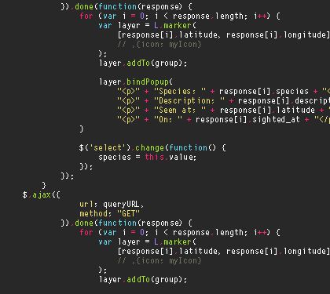
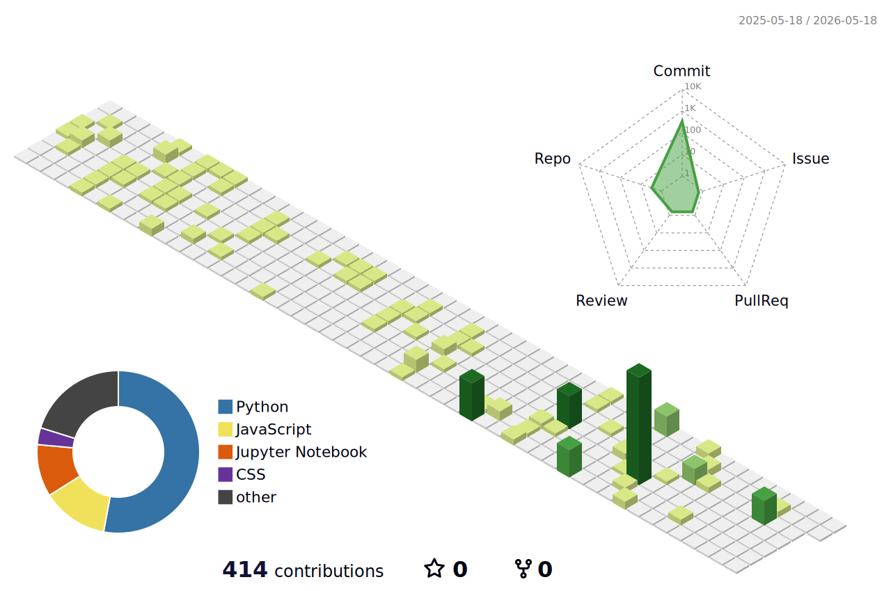

  

<h1 align="center">Welcome to my Github, I'm John Garvey 👋</h1>

  

  

Recent honors graduate in software engineering and current Georgia Tech computer science masters student with hands-on experience in software development, distributed systems, and full-stack development. Highly skilled in multiple programming paradigms, with a strong foundation in data structures, algorithms, database management and cloud deployment.
   
  📍 Arizona

### 👨‍💻 About Me

- 🎓 **Current Education:** Pursuing my **M.S. in Computer Science** at the *Georgia Institute of Technology*.
- 🎓 **Previous Education:** Honors graduate with a B.S. in Software Engineering from *Arizona State University*.
- ⚙️ **Current Obsession:** Prototyping a smart, remote-controlled door hinge utilizing Raspberry Pi Pico, custom sensors, and mechanical clutches (Patent Pending! 🚀).
- ☁️ **Certification:** AWS Certified Cloud Practitioner.
- 🤝 **Community:** Devoted to community outreach and volunteer work.
- 🎨 **Off-Screen:** Tinkering with DIY electronics, reading Mike Mignola comics, and hanging out with my Louie dog.

### 🛠️ Tech Stack & Tools

  <strong>Languages</strong> 
  
  
  
  
  
  
  
  
  

  <strong>Hardware & OS</strong> 
  
  
  
  
  
  

  <strong>Tools, Cloud & Concepts</strong> 
  
  
  
  
  
  
  
  
  
  

### 🚀 Highlighted Projects & Experience

> 🌐 **Note:** All interactive and remote environment projects can be found on my [Project Portfolio](https://jgarvey928.github.io/jsgarveyportfolio.io/).

* 💡 **IoT Smart Hardware Architecture:** Engineered a functional prototype integrating low-level hardware control (Nema 11 motors) with software logic for automated environments. 
* 🎮 **Interactive Web Game:** Developed a fully playable browser-based checkers game built entirely with the "holy three of web dev" (HTML, CSS, and JavaScript).
* 📊 **Displaced Voices Project:** Collaborated with the ASU Library's Unit for Data Science & Analytics to analyze, structure, and present complex open-source datasets.

### 📈 GitHub Stats

  
  

  <picture>
    <source media="(prefers-color-scheme: dark)" srcset="https://raw.githubusercontent.com/jgarvey928/jgarvey928/output/github-contribution-grid-snake-dark.svg">
    <source media="(prefers-color-scheme: light)" srcset="https://raw.githubusercontent.com/jgarvey928/jgarvey928/output/github-contribution-grid-snake.svg">
    
  </picture>

  <picture>
    <source media="(prefers-color-scheme: dark)" srcset="profile-3d-contrib/profile-night-view.svg">
    <source media="(prefers-color-scheme: light)" srcset="profile-3d-contrib/profile-green-animate.svg">
    
  </picture>

  
  
  

